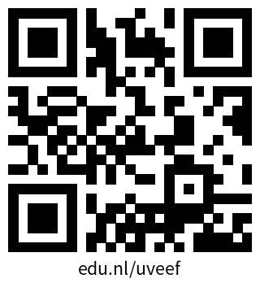

```{r}
#| label: setup
#| include: false

knitr::opts_chunk$set(
  cache = FALSE,
  echo = TRUE,
  message = FALSE,
  warning = FALSE,
  error = FALSE
)
```


## What's next?

- Workshop material and links to other resources will be shared via email
- Have a look at the [Rbanism #30DayMapChallenge](https://github.com/Rbanism/30DayMapChallenge2025) we run yearly in November
- [R Café](https://delft-rcafe.github.io/home/Index.html) - Thematic sessions for TUD-wide community of R users
- [DCC](https://www.tudelft.nl/index.php?id=67120&L=1/) and the [TU Delft Library](https://www.tudelft.nl/en/library/research-data-management/r/training-events/training-for-researchers) - They are there to help

:::: {.columns}

:::{.column width=45%}
- Give us feedback: {.absolute top=340 left=240 width=200}
:::

:::{.column}
- **Drinks!** 🎉 Join Rbanism: {.absolute top=340 left=760 width=200}
:::

::::

