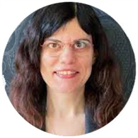
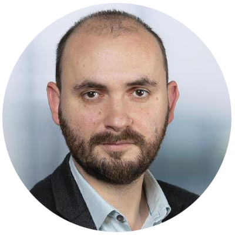
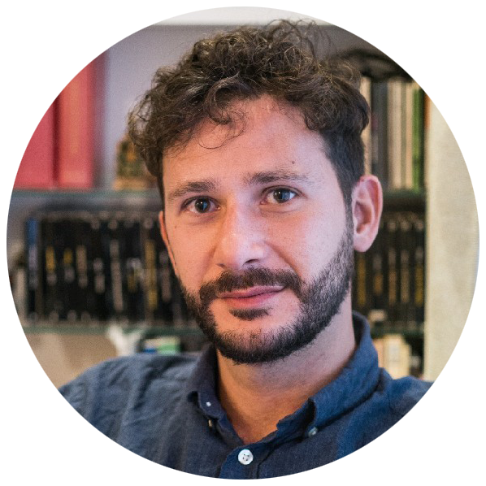
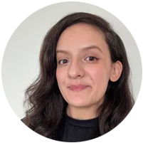
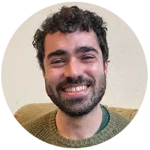

```{r}
#| label: setup
#| include: false

knitr::opts_chunk$set(
  cache = FALSE,
  echo = TRUE,
  message = FALSE,
  warning = FALSE,
  error = FALSE
)
```

# Geospatial Data Carpentry for Urbanism { background-image="fig/tudlib-green.png"}

23 & 26 February 2026 

TU Delft Library, Orange Room

## Meet the team

::: {layout-ncol=6 .caption}














<!--  -->

:::

## Icebreaker {background-image="fig/icebreaker.jpeg"}

<br><br><br><br><br><br><br><br><br><br>Tell us your name and favourite geographic location.

::: {style="font-size: 50%;"}

<br><div>Photo by <a href="https://unsplash.com/@dtropinin?utm_content=creditCopyText&utm_medium=referral&utm_source=unsplash">Dmitrii Tropinin</a> on <a href="https://unsplash.com/photos/red-and-white-ship-on-sea-during-daytime-cmJJJ829kK4?utm_content=creditCopyText&utm_medium=referral&utm_source=unsplash">Unsplash</a></div>

:::


## What will you (not) learn?

::: {.fragment}

<span style="font-size: 75%;">Quoting from the pre-workshop survey:</span>

:::

::: {.fragment .fade-in-then-semi-out}

- ✅ "to use <span style="text-decoration: underline; -webkit-text-decoration-color: red; text-decoration-color: red;">Python</span> or R to process data in a more efficient way"</span>
- ✅ "R language"
- ✅ "Learning a new programming language"
- ✅ "I hope to learn skills that can make me more efficient and self-sufficient"

:::

::: {.fragment .fade-in-then-semi-out}

- ✅ "To be more efficient in collecting, managing and working with <span style="text-decoration: underline; -webkit-text-decoration-color: red; text-decoration-color: red;">large datasets</span> through the applications surrounding geodata analysis."
- ✅ "To learn how to cope with <span style="text-decoration: underline; -webkit-text-decoration-color: red; text-decoration-color: red;">large datasets</span> in a more efficient way then using exel or GIS software."

:::

::: {.fragment}

- 🚫 "How to conduct statistical analysis combing geo information"
- 🚫 "data scraping methods"

:::

## Program

::: {.fragment}

**Day 1**

  - 09:00-09:15 Introduction
  - 09:15-12:15 Part 1. **Introduction to R** (incl. 1 break)
  - 12:15-13:00 Lunch
  - 13:00-16:40 Part 2. **Working with vector data in R** (incl. 1 break)
  - 16:40-17:00 Closing & feedback

:::

::: {.fragment}

**Day 2**

  - 09:00-09:10 Opening
  - 09:10-12:15 Part 3. **Working with raster data in R** (incl. 1 break)
  - 12:15-13:00 Lunch
  - 13:00-16:40 Part 4: **Working with OSM data and GIS in R** (incl. 1 break)
  - 16:40-17:00 Closing & feedback
  - 17:00 Drinks
  
:::

## How do we work?

::: {.incremental}

- **Code along** with the instructor.

- With **🟩 <font color="green">green</font> and 🟥 <font color="red">red</font> sticky notes** you indicate that you 🟩 <font color="green">are</font> or 🟥 <font color="red">are not</font> on track when prompted by the instructor. 

- When you are stuck, **put a 🟥 <font color="red">red</font> sticky note on the back of your screen** and a helper will approach you.

- **Copy & paste code from the [livecode repository](https://edu.nl/mabrd)** if you are behind and need to catch up.

:::

## Code of conduct

- Use welcoming and inclusive language

- Be respectful of different viewpoints and experiences

- Gracefully accept constructive criticism

- Focus on what is best for the community

- Show courtesy and respect towards other community members

If you believe someone is violating the [Code of Conduct](https://docs.carpentries.org/topic_folders/policies/code-of-conduct.html), we ask that you report it to The Carpentries Code of Conduct Committee [completing this form](https://goo.gl/forms/KoUfO53Za3apOuOK2), who will take the appropriate action to address the situation.

## Practicalities 

::: {.incremental}

- **We might take photos during the workshop**, and we will try to do so mostly from the back. We might use those photos for promotional purposes and for reporting on the workshop on our communication channels. Let us know if you do not want to appear on the photos.

- **Ph.D. candidates receive 1,5 GS credits** if they attend and actively participate in the entire workshop - attendance forms will be handed out at the end of Day 2.

- **Lunch** (both days), **coffee/tea** (breaks) and **drinks** (end of day 2) will be provided.

:::

# <br><br>Competition {background-image="fig/competition.jpeg"}

::: {div}

::: {style="font-size: 50%;"}

<br><br><br><br><br><br><br><br><br><br><br><br><div>Photo by <a href="https://unsplash.com/@markkoenig?utm_content=creditCopyText&utm_medium=referral&utm_source=unsplash">Mark König</a> on <a href="https://unsplash.com/photos/a-group-of-people-rowing-on-a-body-of-water-fNXJs8IVFHA?utm_content=creditCopyText&utm_medium=referral&utm_source=unsplash">Unsplash</a></div>

:::

:::
